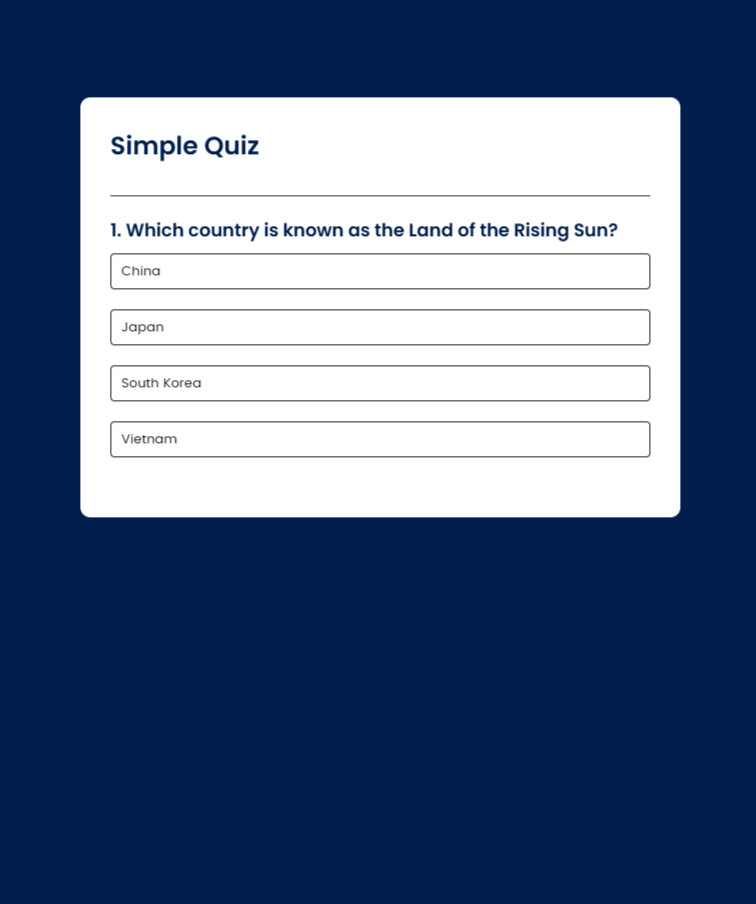

live--> https://storied-puppy-e50324.netlify.app/

Quiz Application

This is a simple and interactive quiz application that allows users to test their knowledge on various topics. The app features a clean interface and dynamically updates the score based on user responses.

Features
- Multiple-choice questions with selectable options.
- Instant feedback on whether the selected answer is correct.
- Displays the final score at the end of the quiz.
- Responsive design for both desktop and mobile devices.

How to Use
1. Start the quiz by clicking the "Start" button.
2. Select an answer for each question.
3. Receive immediate feedback for your choice.
4. Complete the quiz to view your final score.

Technologies Used
- HTML for structure.
- CSS for styling.
- JavaScript for functionality and interactivity.

Installation
1. Clone the repository:
   git clone https://github.com/kaplansk/Quiz-App

2. Open the project folder.
3. Launch the `index.html` file in your browser.

Customization
- Add or modify questions in the JavaScript file.
- Customize styles in the CSS file to match your preferences.

License
This project is licensed under the MIT License. See the LICENSE file for details.

Feedback and Contributions
Feedback and contributions are welcome. Feel free to fork the repository and submit pull requests!
